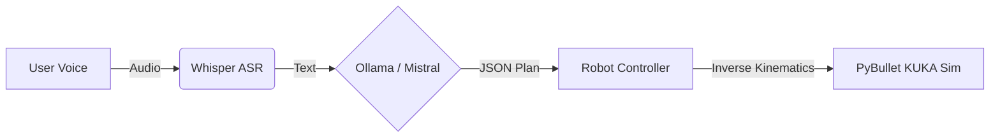

# 🤖 Voice-Controlled KUKA Robot with LLM Planning


## 📖 Overview

This project implements an **end-to-end voice control pipeline** for a KUKA iiwa robotic manipulator. Unlike traditional voice control systems that rely on hard-coded keywords, this system utilizes a **Large Language Model (Mistral via Ollama)** to interpret natural language, understand intent, and generate structured mission plans (JSON) for the robot to execute in a physics-based simulation (PyBullet).

The entire pipeline—Speech Recognition, Reasoning, and Simulation—runs **locally** (Offline) for privacy and low latency, utilizing GPU acceleration.

### 🎯 Key Features
1) **Natural Language Understanding:** The robot understands complex commands like *"Grab the red box and put it in the drop zone"* rather than just fixed keywords.
2) **Local Inference:** Uses **OpenAI Whisper (Turbo)** for ASR and **Mistral** for logic, running entirely on local hardware (tested on Intel i9 + RTX 4070).
3) **Modular Architecture:** Decoupled "Ear" (Sensors), "Brain" (Planner), and "Body" (Actuator) modules.
4) **Physics Simulation:** Implements a magnetic gripper logic using PyBullet constraints to handle object manipulation reliability.

### 🛠️ Tech Stack
* **Language:** Python 3.12
* **Simulation:** PyBullet (Physics engine)
* **ASR (Speech-to-Text):** OpenAI Whisper (turbo model)
* **LLM (Logic):** Ollama running mistral
* **Libraries:** speech_recognition, numpy, torch, msvcrt

---

### 🏗️ System Architecture

The data flow follows a strictly modular **Perception-Cognition-Action** loop:



1) The Ear: Captures audio via SpeechRecognition, pre-processes signal (noise reduction), and transcribes using Whisper.
2) The Brain: The transcript is fed into Mistral with a strict System Prompt. The LLM converts unstructured text into a structured JSON list of actions (e.g., move_to, magnet_on).
3) The Body: A Python controller parses the JSON, calculates Inverse Kinematics (IK) for the KUKA arm, and handles physics constraints.

### 🚀 Installation & Setup
**1. Prerequisites**
Ensure you have Python installed and an NVIDIA GPU (recommended for Whisper/Ollama speed).

**2. Install Dependencies**
pip install pybullet numpy torch openai-whisper speechrecognition ollama
(Note: You may need pyaudio for microphone access. On Windows: pip install pipwin && pipwin install pyaudio)

**3. Setup Ollama (The Brain)**
1) Download and install
    [Ollama](https://ollama.com/).

2) Pull the Mistral model:
   ```
    ollama pull mistral
    ```
4) Start the server (keep this terminal open):
   ```
    ollama serve
    ```
### 🕹️ Usage
1) Run the main script: python main.py
2) The PyBullet GUI will launch.
3) Press ENTER in the console to trigger the listening mode.
4) Speak a command:
    "Pick up the blue box."
5) Watch the robot plan and execute the task!

### 🧠 Logic Sample
**Input: "Grab the green one and drop it off."**

**LLM Generated Plan: JSON**
```json
[
  { "action": "move_to", "target": "green_box" },
  { "action": "magnet", "state": "on" },
  { "action": "move_to", "target": "drop_zone" },
  { "action": "magnet", "state": "off" }
]
```
### 📸 VISUAL IDEA


### 👤 Author
**Jai Doshi (JD)**  
Masters Student: Mechatronics [@RWU GERMANY](https://www.rwu.de/en)

